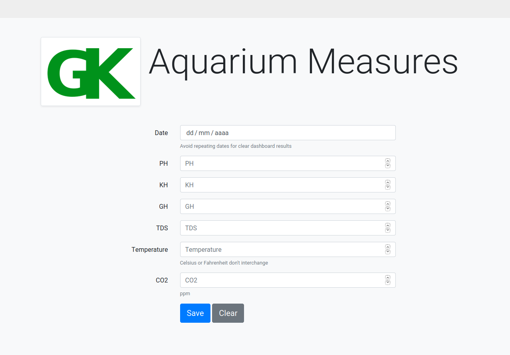
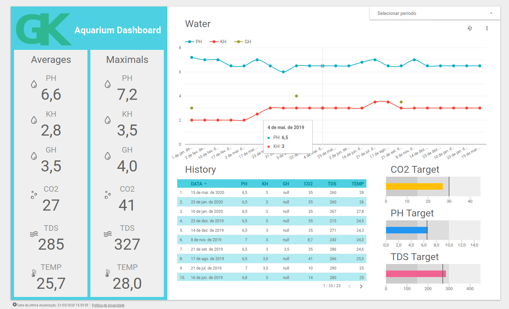
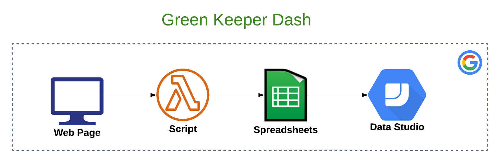

## Description

Would you like to track historical informations about your aquarium like PH, KH and Temperature, in a cloud based dashboard that you can use for free?

If so this project is for you, **everything** you need is an active [Google Account](https://google.com/account).

## Screen Shots :tropical_fish:

## Requirements

You must have a **Google Account** connected with following services:
- [Google App Scripts](https://script.google.com): Host for the lambda functions that register the aquarium measures.
- [Google Spreadsheets](https://docs.google.com/spreadsheets): Keep our measures data.
- [Google Data Studio](https://datastudio.google.com): Read our measures and show as beautiful dashboard.

## Install it

#### Google Spreadsheet steps
- Access https://docs.google.com/spreadsheets and create a new blank spreadsheet and save it.
  - Use the spreadsheet URL to copy its ID (we need it later).
    - ID = `https://docs.google.com/spreadsheets/d/COPY_THIS_PART/edit`

#### Google App Scripts steps
- Access https://script.google.com and click on **New project**.
- For each file on project's `src` directory create a new file on `Google App Scripts` **with the same name**:
  - **File > New > Script** for `.gs` and `.json` files
  - **File > New > HTML** for `.html` files
  - Simply copy and paste file contents.
  - For the file `main.gs` you need a single edition:
    - Search for `SpreadsheetApp.openById` and paste your spreadsheet ID where is `Your spreadsheet ID`
- Click **File > Save all** to save all changes.
- Now we can publish the application using **Publish > As web application...**.
  - On the dialog mark the options:
    - `Execute the app as` = Me
    - `Who as access to the app` = Only myself
  - Click **Update**
  - You will be asked to authorize the application to access your `Google Spreadsheets` .
  - Note that **only you will be able to access the app**, so ignore the security warning and authorize it:
    - Click `Advanced` link on warning page to do it
  - Save the `Current web app URL` to access it later

#### Google Data Studio steps

- Access https://datastudio.google.com and click **New Report**
- On **Datasource Selection** select `Google Spreadsheets`
  - Pick the same spreadsheet you selected before on `Google App Scripts`
- Build your dashboard and save it:
  - Templates couldn't be shared :cry:.
  - Quite simple to build one [check it out](https://www.youtube.com/watch?v=6FTUpceqWnc).
  - Pick `avg`, `sum`, `max` values to get good insights from your data.

## Using it

- Access the `Current web app URL` to input data.
- Access the `Google Studio Scripts` dashboard read insights.

## References
* [Apps Script Reference](https://github.com/gsuitedevs/apps-script-samples/tree/master/tasks/simpleTasks)
* [Apps Script Best Practices](https://developers.google.com/apps-script/guides/html/best-practices)
