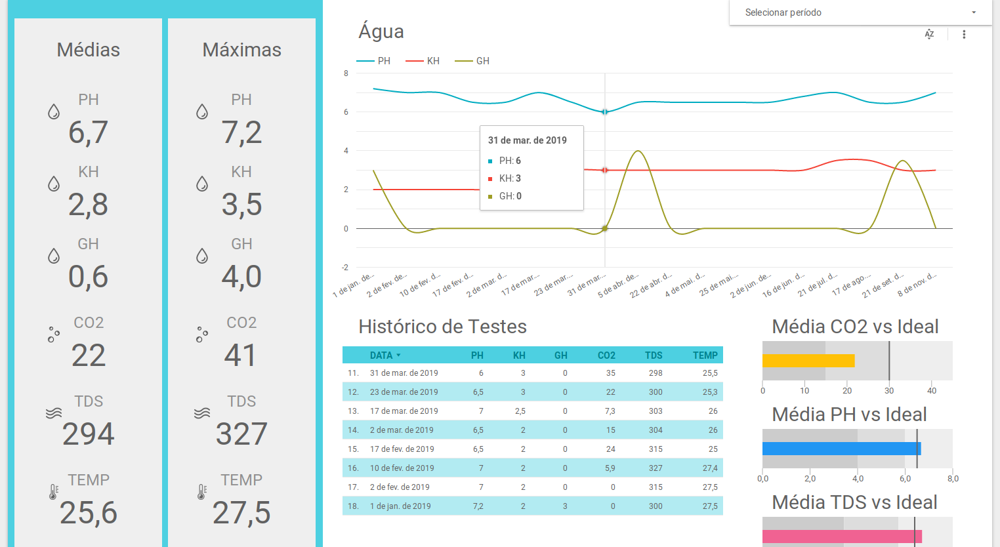

## Description

Would you like to track historical informations about your aquarium  like PH, KH and Temperature, in a cloud based dashboard that you can use for free?

If so this project is for you. Everything you need is an active [Google Account](https://google.com/account).

## Requirements

You must have a **Google Account** connected with following services:
- [Google Docs](https://google.com/docs) to keep a spreadsheet with aquarium daily/monthly mesures
- [Google Data Studio](https://datastudio.google.com) to keep the dashboard read from the spreadsheet
- [Google App Scripts](https://script.google.com) to keep a simple web application running

**You don't require ANY programming skills**

## How it Works?

## References
* [Apps Script Reference](https://github.com/gsuitedevs/apps-script-samples/tree/master/tasks/simpleTasks)
* [Apps Script Best Practices](https://developers.google.com/apps-script/guides/html/best-practices)